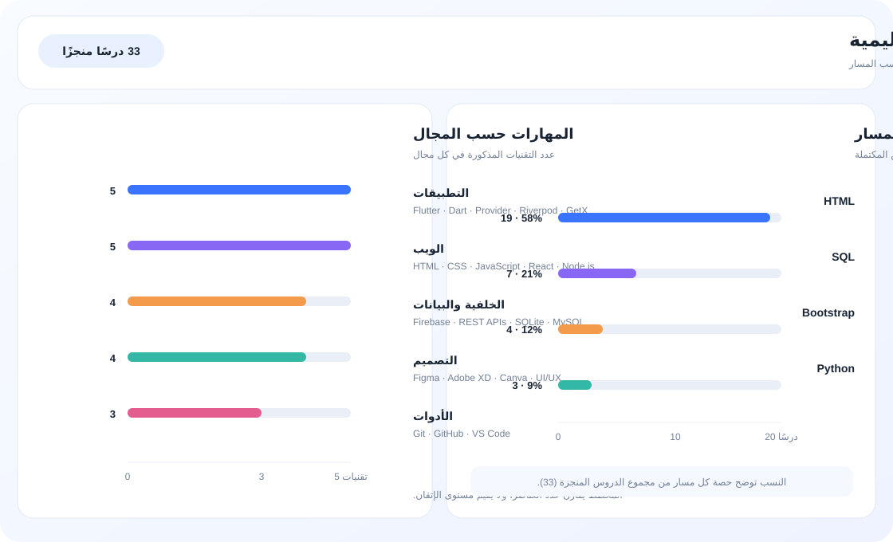

# أهلاً، أنا أشجان العجيلي

### Flutter & Dart Developer · UI/UX Designer · Web & Mobile Builder

أبني تجارب رقمية عملية وواجهات هادئة وسهلة الاستخدام، مع اهتمام بالتفاصيل وجودة تجربة المستخدم.

---

## عني

- أطور تطبيقات **Flutter** للويب والهواتف.
- أصمم واجهات وتجارب مستخدم باستخدام **Figma** و**Adobe XD** و**Canva**.
- أتعلم باستمرار وأحوّل تقدمي إلى بيانات واضحة قابلة للمتابعة.
- أعمل على الجمع بين التصميم، البرمجة، والمنتج في تجربة واحدة متناسقة.

## المهارات الأساسية

| المجال | الأدوات والتقنيات |
| --- | --- |
| **التطبيقات** | Flutter · Dart · Provider · Riverpod · GetX |
| **الويب** | HTML · CSS · JavaScript · React · Node.js |
| **الخلفية والبيانات** | Firebase · REST APIs · SQLite · MySQL |
| **التصميم** | Figma · Adobe XD · Canva · UI/UX |
| **الأدوات** | Git · GitHub · VS Code |

## لوحة التقدم التعليمية

> بيانات هذه اللوحة مأخوذة مباشرة من مستودع [w3schools-progress](https://github.com/ashjanalajeeli/w3schools-progress)، وتُحدّث عند تعديل `progress.json`.

| المسار | الدروس المكتملة | النسبة من الإجمالي |
| --- | ---: | ---: |
| HTML | **19** | **58%** |
| SQL | **7** | **21%** |
| Bootstrap | **4** | **12%** |
| Python | **3** | **9%** |
| **الإجمالي** | **33** | **100%** |

[فتح مستودع لوحة التقدم ←](https://github.com/ashjanalajeeli/w3schools-progress)

## مشاريعي

- [**W3Schools Progress**](https://github.com/ashjanalajeeli/w3schools-progress) — لوحة مرئية لمتابعة التعلم والإنجاز.
- [**Marketing**](https://github.com/ashjanalajeeli/marketing) — مساحة عمل لمشاريع وأفكار التسويق.

## تواصل معي

إذا كان لديك مشروع، فكرة، أو فرصة تعاون في التطبيقات أو التصميم، يسعدني التواصل.

---

*أتعلم، أبني، وأحسّن — خطوة بعد خطوة.*

