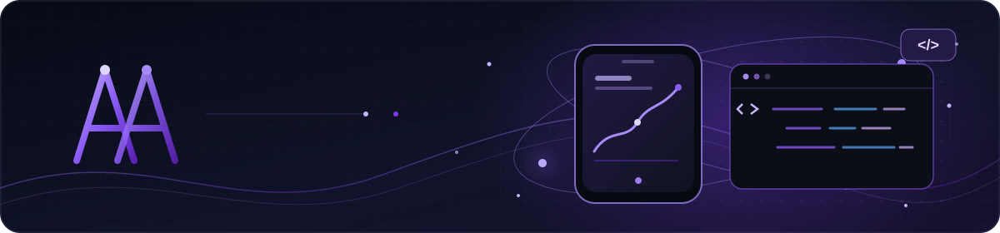
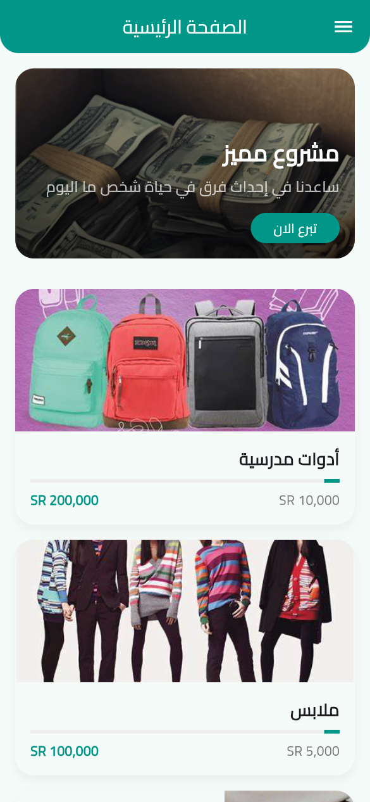

# أشجان العجيلي

### مطوّرة Flutter & Dart · مصمّمة UI/UX

أصمّم واجهات واضحة وأطوّر تجارب رقمية للويب والهواتف، مع اهتمام بالتفاصيل واتساق التجربة من الفكرة إلى المنتج.

---

## 01 / نبذة

أجمع بين التصميم والبرمجة لبناء واجهات وتجارب استخدام عملية وهادئة. أعمل على تطبيقات **Flutter** للويب والهواتف، وأستخدم أدوات التصميم لتحويل الأفكار إلى منتجات رقمية متناسقة.

## 02 / المهارات التقنية

- **Flutter & Dart:** `Flutter` · `Dart` · `Provider` · `Riverpod` · `GetX`
- **تطوير الويب:** `HTML` · `CSS` · `JavaScript` · `React` · `Node.js`
- **البيانات وواجهات API:** `Firebase` · `REST APIs` · `SQLite` · `MySQL`
- **التصميم:** `Figma` · `Adobe XD` · `Canva` · `UI/UX`
- **أدوات العمل:** `Git` · `GitHub` · `VS Code`

## 03 / التعلّم بالأرقام

**33 درسًا مسجّلًا** عبر المسارات التالية:

-  `██████████`
-  `████░░░░░░`
-  `██░░░░░░░░`
-  `██░░░░░░░░`

> الأشرطة تقارن أعداد الدروس المسجّلة في هذه القائمة فقط؛ ولا تعبّر عن نسبة إكمال المنهج أو مستوى الإتقان.

## 04 / مشاريعي

### Ekfalni — تطبيق الكفالة والتبرعات

  
   
  <strong>واجهة الهاتف</strong>

> معاينة الهاتف ملتقطة من واجهة Flutter الفعلية؛ يفتح النقر على الصورة مستودع Ekfalni، إذ لا يوجد رابط تطبيق منشور.

### Marketing

  

مستودع التوثيق (README) فقط؛ لا توجد واجهة تطبيق منشورة لمعاينتها.

---

*تفاصيل مدروسة · واجهات هادئة · تجارب رقمية متناسقة*

